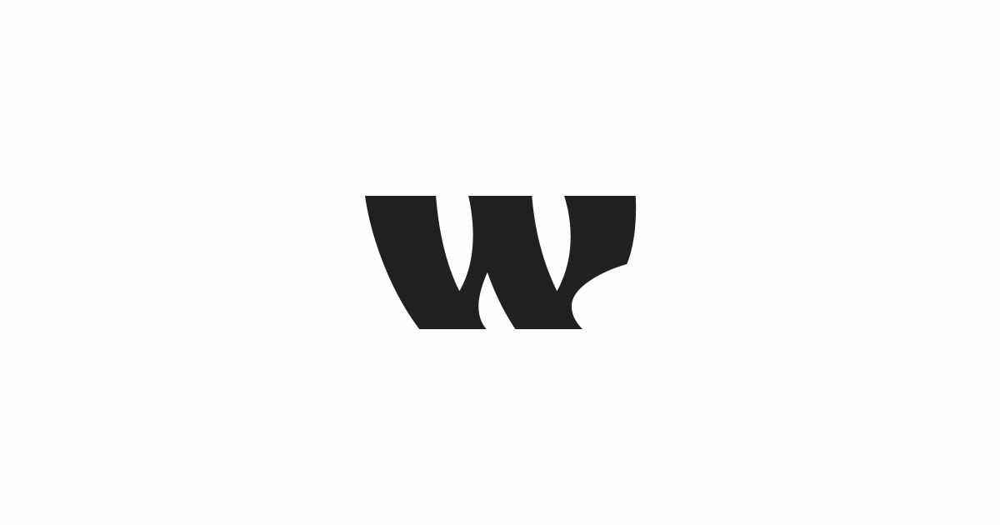

# Wyne Studio

**Two french developers. One shared obsession with clean code and creative solutions.**

---

## Who we are

Wyne Studio is a duo of passionate French developers — **Mylano** and **Anrazzi** — who build, experiment, and ship.

We started with a shared curiosity for how things work under the hood, and turned it into a practice of crafting reliable, well-thought-out software. Whether it's a FiveM resource running live on a server or a web interface built from scratch, we care about the details.

---

## What we do

**FiveM Development**
We write Lua scripts and full resources for the FiveM platform — from game mechanics to custom UI. Performance and maintainability are non-negotiable for us.

**Web Development**
We design and build websites and web applications. Clean structure, readable code, and a good user experience are the baseline, not the goal.

---

## Stack

| Domain | Technologies                              |
| ------ | ----------------------------------------- |
| FiveM  | Lua, JavaScript, HTML/CSS                 |
| Web    | HTML, CSS, JavaScript, React              |
| Tools  | Git, VS Code, CodeWalker, OpenIV, Blender |

---

## Our projects

> Our repositories are private. But the resources are availble to purchase on our website: [Wyne Studio](https://wynestudio.com)

Each resource is documented on our [documentation](https://docs.wynestudio.com)

| Project               | Description                         | Stack      |
| --------------------- | ----------------------------------- | ---------- |
| wyne-notify-hermes    | Notification System for Fivem       | Lua /JS    |
| wyne-notify-odin      | Notification System for Fivem       | Lua / JS   |
| wyne-boattrailer      | Boat Trailer for Fivem              | Lua        |
| wyne-weaponsonback    | Weapons visible on player's back    | Lua        |
| wyne-peds             | Pegs for bicycles                   | Lua        |
| wyne-store            | Tebex Store for Wyne Studio         | React      |
| wyne-plumber          | Plumber job for Fivem               | Lua        |
| wyne-playerdisconnect | Create a ped when player disconnect | Lua        |
| wyne-adminmenu        | Advanced admin menu                 | Lua        |
| wyne-kiosk            | Kiosk screen for Fivem              | Lua/ React |
| wyne-bliptool         | Advanced blip tool for Fivem        | Lua        |
| wyne-electrician      | Electrician job for Fivem           | Lua        |
| wyne-fishing          | Fishing activity for Fivem          | Lua        |
| wyne-vehicletransport | vehicle transport system for Fivem  | Lua        |
| wyne-miner            | Miner job for Fivem                 | Lua        |
| wyne-banking          | Banking system for Fivem            | Lua, React |
| wyne-dockworker       | Dockworker job for Fivem            | Lua        |
| wyne-hunting          | Hunting for Fivem                   | Lua        |
| wyne-yard             | Yard job for Fivem                  | Lua        |

---

## Get in touch

Have a project in mind or want to collaborate?

- Mylano — [GitHub](https://github.com/Mylaano)
- Anrazzi — [GitHub](https://github.com/SebMZI)

---

Built with passion somewhere in France.

